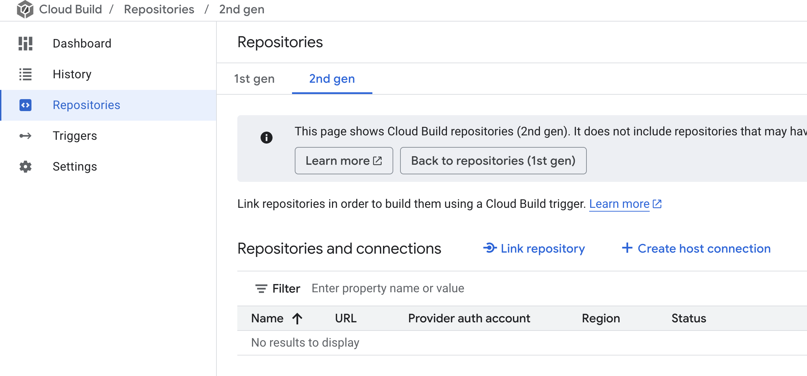
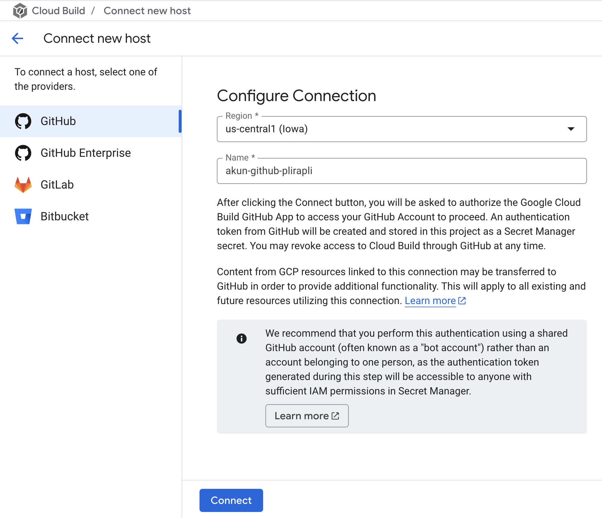
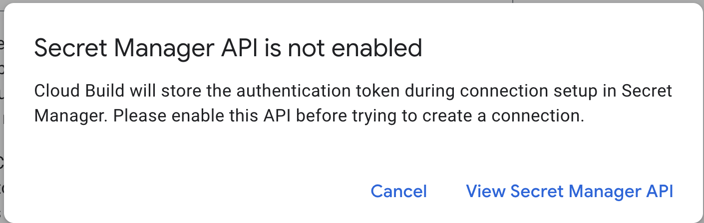
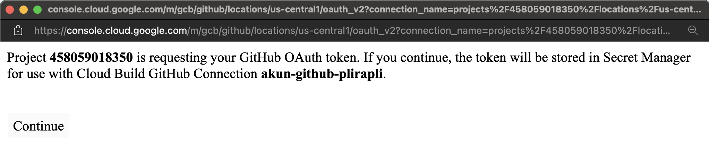
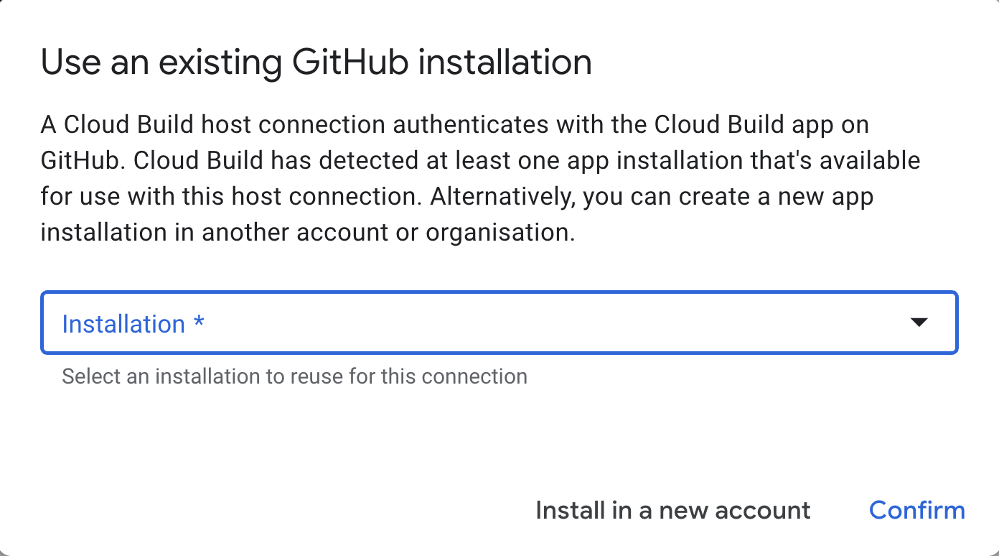
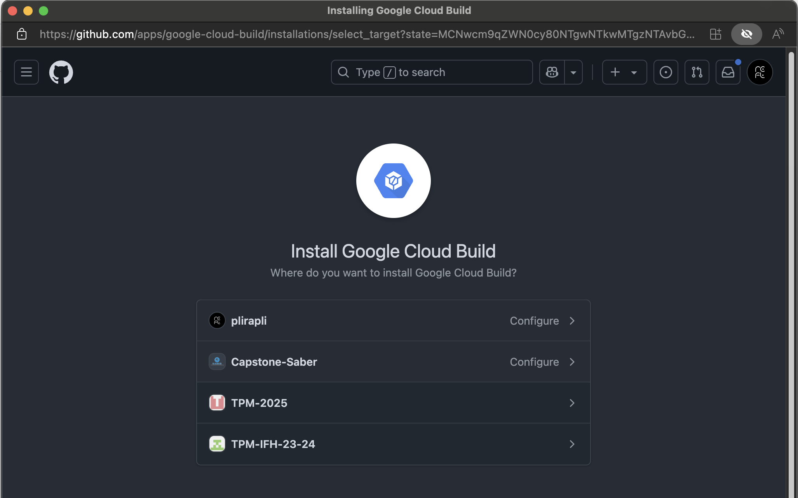
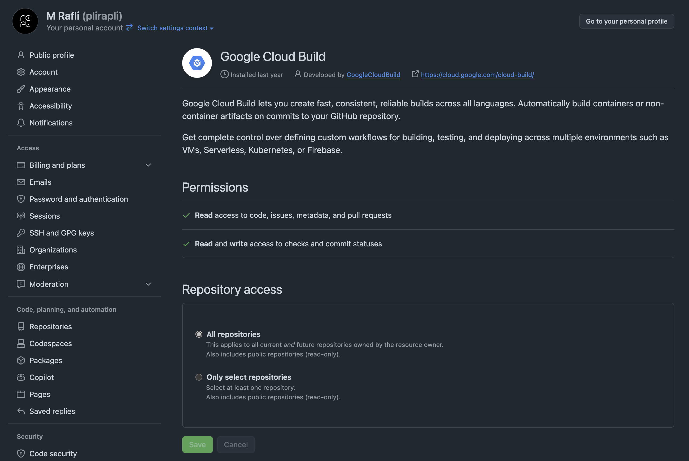
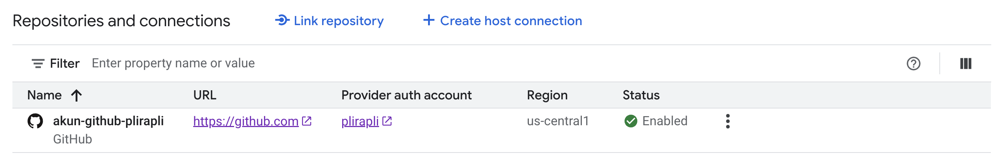
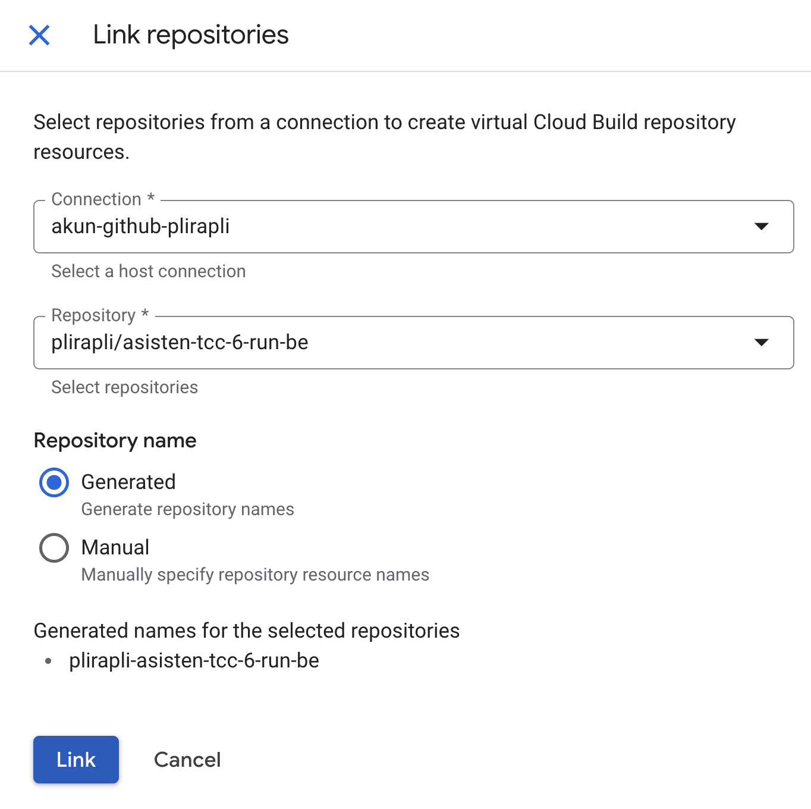

# Praktikum TCC Pertemuan 6

## How to setup:

- Clone repository ini
- Buka isi dari file cloudbuild.yaml, di situ telah ada penjelasan tiap-tiap perintah/langkah yang akan digunakan untuk melakukan CI/CD menggunakan Service Cloud Build
- Setelah itu, masuk ke menu Cloud Build pada GCP, klik "enable" pada Cloud Build API (Jika belum pernah mengaktifkan)

- Sambungkan akun GitHub ke Cloud Build dengan cara masuk ke sub-menu "Repositories", lalu klik "Create host connection"

- Isi region (disarankan menggunakan us-central1) dan nama koneksinya (bebas). Setelah itu, klik "Connect"

- Jika ada pop-up seperti gambar di bawah, itu artinya Secret Manager API belum diaktifkan, aktifkan API tersebut dengan cara menekan "View Secret Manager API"

- Jika sudah, kembali ke Cloud Build dan Create host connection ulang, lalu klik "connect". Setelah itu, akan muncul sebuah pop-up, pilih "Continue"

- Pilih "Install in a new account", setelah itu pilih akun GitHub yang akan dihubungkan.

- Pada bagian Repository Access, pilih "All Repositories" agar semua repository GitHub terhubung ke Cloud Build.

- Jika akun sudah terhubung, selanjutnya klik "Link repository"

- Isi connection dengan akun kalian dan repository dengan repository yang akan digunakan untuk melakukan CI/CD. Setelah itu, klik "Link".

- Setelah itu, kita akan membuat sebuah trigger yang berfungsi untuk mengotomatiskan proses build dan deployment ketika suatu peristiwa (event) tertentu terjadi. Masuk ke sub-menu "Triggers" dan klik "Connect repository". Masukkan akun GitHub yang telah dihubungkan dan pilih repository yg akan digunakan, kemudian, klik "Connect".

- Jika sudah, klik "Create Trigger", masukkan nama trigger (bebas) dan pada bagian Event, pilih "push to a branch" karena kita akan menjalankan trigger ketika kita melakukan push kode kita ke suatu branch. Kemudian pada Source, pilih 2nd gen (karena kita menghubungkan akun kita menggunakan 2nd gen) dan pilih repository yg akan di-trigger. Pada bagian branch, pilih main, artinya trigger akan berjalan HANYA ketika di-push ke branch main. Pada bagian Configuration Type, pilih "Cloud Build configuration file (YAML or JSON)" dan Location-nya pilih "Repository". Hal tersebut berarti sistem secara otomatis akan menjalankan isi file yang ada pada cloudbuild.yaml ketike ter-trigger. Jika sudah, klik create.

- Setelah itu, klik Run untuk menjalankan trigger secara manual (Hanya untuk mengecek apakah konfigurasi yg telah dilakukan sudah benar atau belum)

