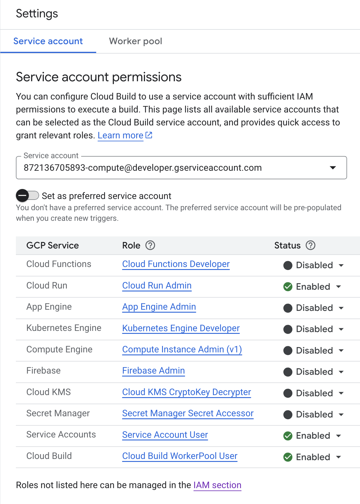
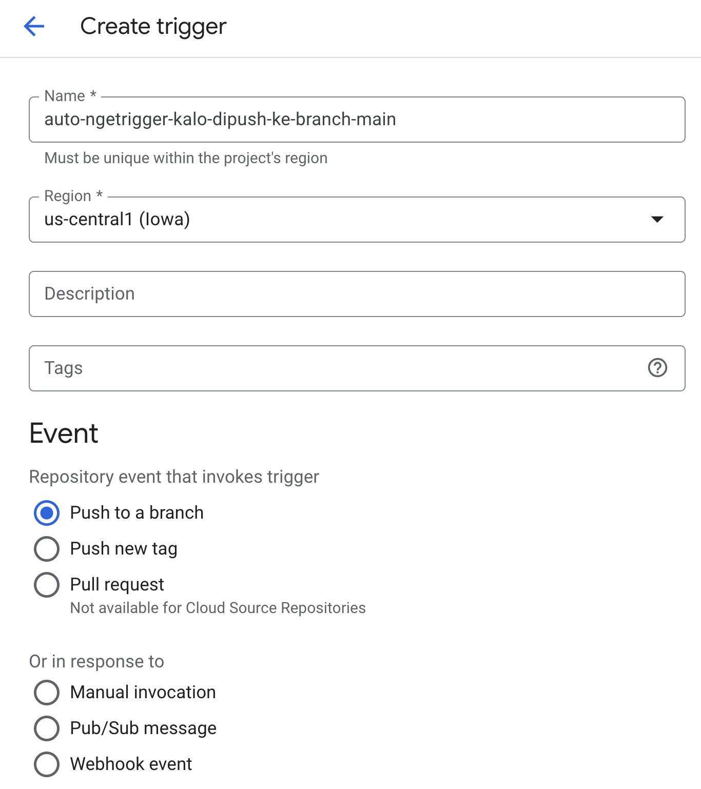
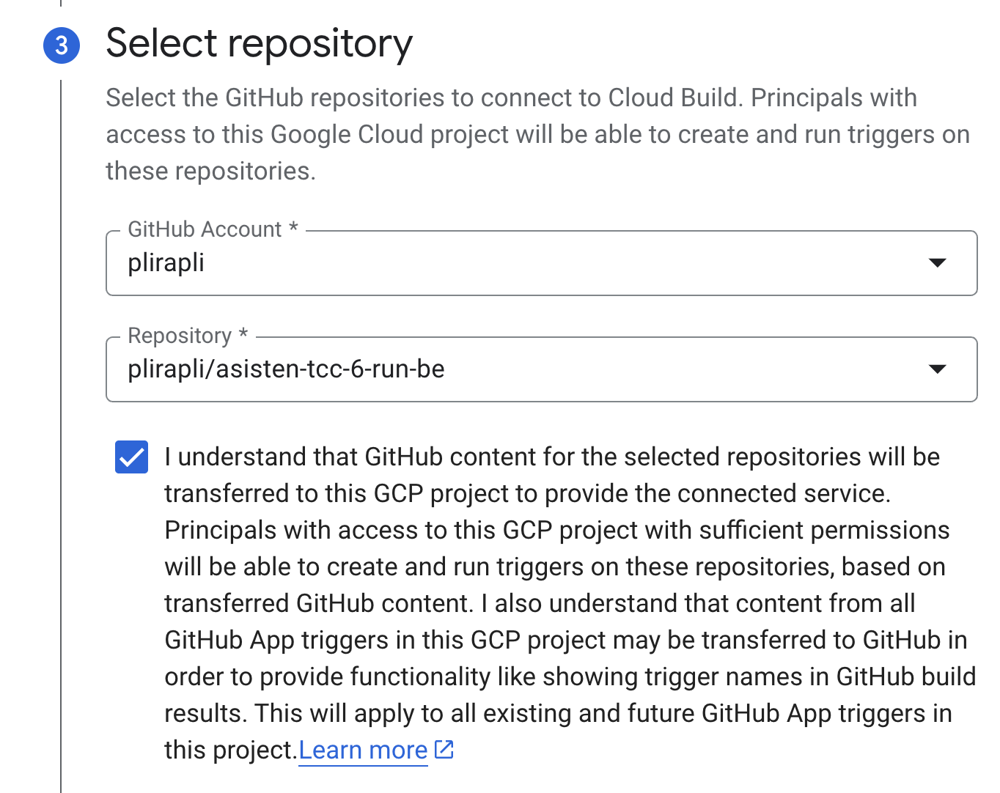
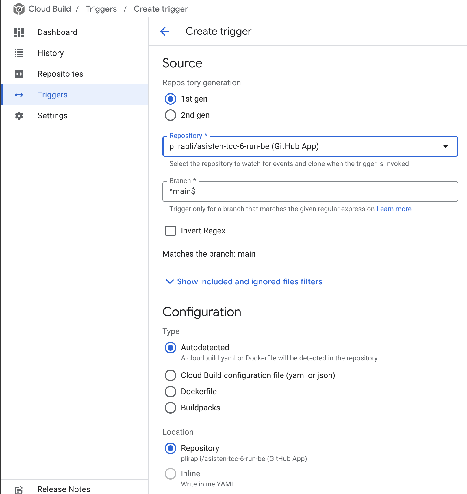
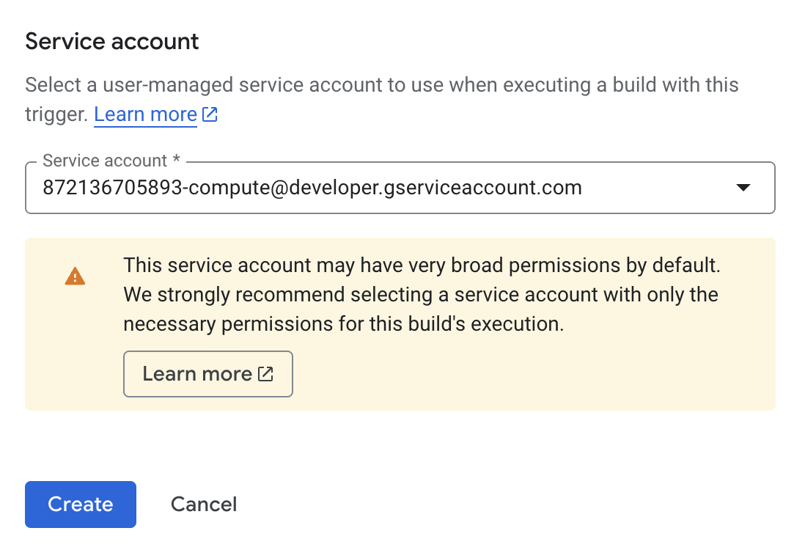
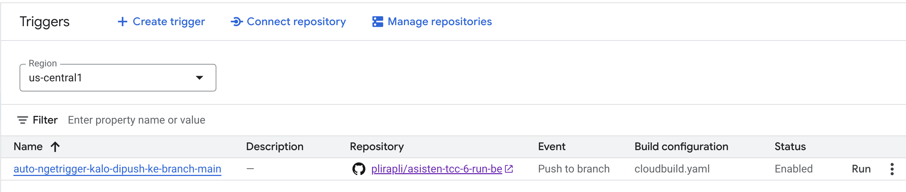
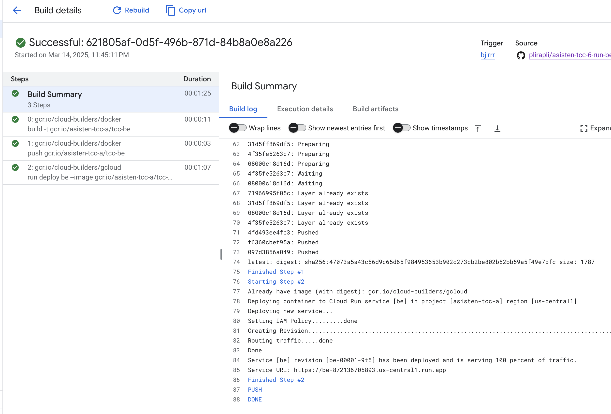

# Praktikum TCC Pertemuan 6

## How to setup:

1. Fork repository ini ke akun kalian.
2. Buka isi dari file cloudbuild.yaml, di situ telah ada penjelasan tiap-tiap perintah/langkah yang akan digunakan untuk melakukan CI/CD menggunakan Service Cloud Build
3. Setelah itu, masuk ke menu Cloud Build pada GCP, klik "enable" pada Cloud Build API (Jika belum pernah mengaktifkan)

4. Setelah itu, masuk ke setting, ubah menjadi enabled pada bagian Cloud Run, Service Accounts, dan Cloud Build.

5. Jika sudah, masuk ke sub-menu trigger dan klik "Create Trigger", masukkan nama trigger (bebas) dan pada bagian Event, pilih "push to a branch" karena kita akan menjalankan trigger ketika kita melakukan push kode kita ke suatu branch. Kemudian pada Source, pilih repository yg akan di-trigger (jika belum pernah mendaftarkan repository, pilih Connect new repository), di sini kita akan memilih repository yg akan dilakukan CI/CD. Pilih GitHub (Cloud Build GitHub App), lalu pilih repository-nya, kemudian klik "Conenct".

6. Pada bagian branch, pilih main, artinya trigger akan berjalan HANYA ketika di-push ke branch main. Pada bagian Configuration Type, pilih "Cloud Build configuration file (YAML or JSON)" dan Location-nya pilih "Repository". Hal tersebut berarti sistem secara otomatis akan menjalankan isi file yang ada pada cloudbuild.yaml ketike ter-trigger. Jika sudah, klik create.

7. Pada bagian service account, pilih service account yg diberi akses pada langkah 4. Setelah itu, klik "Create".

8. Setelah itu, klik Run untuk menjalankan trigger secara manual (Hanya untuk mengecek apakah konfigurasi yg telah dilakukan sudah benar atau belum)

9. Jika sudah berhasil, maka pada bagian log akan memiliki tampilan seperti ini

